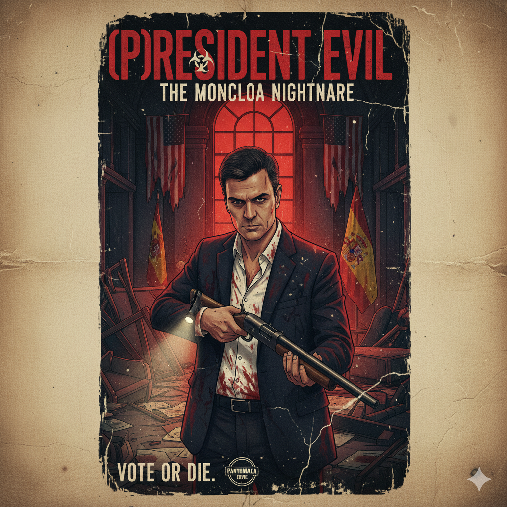

# (P)Resident Evil: The Moncloa Nightmare

> **"Vote or Die."**

 **

Bienvenido al repositorio oficial de **(P)Resident Evil: The Moncloa Nightmare**, un videojuego satírico desarrollado por **Grupo Pantumaca**.

Este proyecto combina mecánicas de **Acción, RPG y Survival Horror** en una versión distópica y corrupta del Palacio de la Moncloa, donde la política es literalmente una cuestión de vida o muerte.

---

## 📖 Sinopsis

En un mundo de alta tensión geopolítica, una extraña infección ha convertido la sede del gobierno español en una fortaleza de pesadilla. Juegas como **Pedro Sánchez**, el "hombre de acero", quien despierta en la última planta del edificio.

Tu misión es simple pero aterradora: descender planta por planta, sobrevivir a hordas de infectados y enemigos políticos invencibles, y escapar antes de que tu **Nivel de Corrupción** llegue al 100%.

---

## 🎮 Características Principales

* **Terror Político:** Una ambientación oscura y fotorrealista inspirada en *Resident Evil 2 Remake*, situada en los pasillos de La Moncloa.
* **Mecánicas Híbridas:**
    * **Acción:** Combate contra enemigos con estados alterados (Mareado, Decretazo).
    * **RPG:** Sistema de afinidades "Piedra-Papel-Tijera" (Liberal > Conservador > Socialista) y reclutamiento de aliados políticos.
    * **Survival Horror:** Gestión de recursos escasos como el "Tiempo de palabra" y puntos de guardado limitados.
* **Enemigos Únicos:** Enfréntate a líderes mundiales como **Donald Trump** o **Xi Jinping**, y huye de amenazas invencibles como el **Tribunal de Cuentas**.
* **Sistema de Progreso:** Encuentra el "Sobre con dinero negro" para sobornar a los jefes de planta y desbloquear el descenso.

---

## 🛠️ Tecnología

El proyecto está desarrollado utilizando:
* **Motor:** Unreal Engine (Blueprints & C++).
* **Arquitectura:** Estructura modular con `GameModes` específicos para exploración y batalla.

---

## 📂 Documentación

Para ver los detalles técnicos, la historia completa y el desglose de mecánicas, consulta la carpeta de documentación:

👉 **[Ir a la Documentación del Proyecto (./docs)](./docs/README.md)**

Allí encontrarás:
1.  Historia y Ambientación detallada.
2.  Desglose matemático de las mecánicas RPG y de Acción.
3.  Referencias de diseño y diagramas de clases.

---

## 👥 Equipo "Grupo Pantumaca"

| Rol | Miembro |
| :--- | :--- |
| **Gestión** | David Covián Gómez |
| **Diseño** | Aitor Gómez Ogueta |
| **Arte** | Diego Martínez Chamorro |
| **Marketing** | Ignacio Hoyos Diego |
| **Programación** | Javier Yáñez Luzón |

---

### ⚠️ Disclaimer
*Este videojuego es una obra de ficción satírica. Cualquier parecido con la realidad es pura coincidencia (o una estrategia de campaña).*
